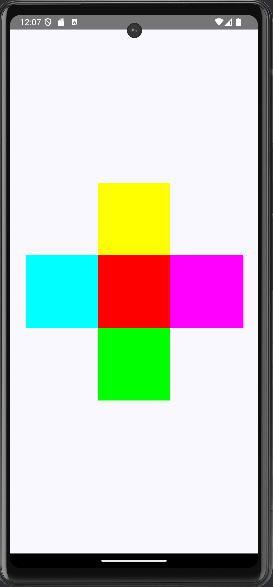

# Android App with ConstraintLayout
## Add dependency inside Gradle Scripts
To be used is necessary to add a dependency inside `build.grandle.kts (Module :app)`:
```
implementation("androidx.constraintlayout:constraintlayout-compose:1.0.1")
```

## The expected result is:
